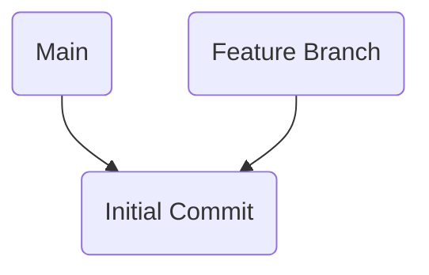
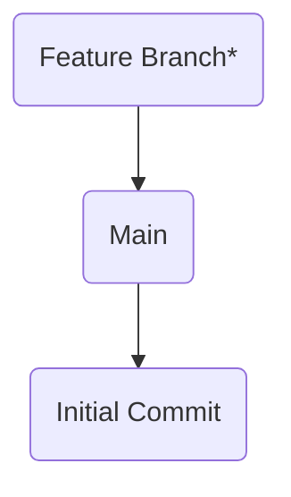

# Git Workshop - Rebase

Instructions:

1. Clone this repo `git clone git@github.com:twopoint718/git-workshop-rebase.git`
2. Check out the feature branch, `git checkout feature-branch`
3. There are conflicting changes between `main` and `feature-branch`.
   Use `git rebase` to reconcile these changes.

## Diagrams

### Before

### After

